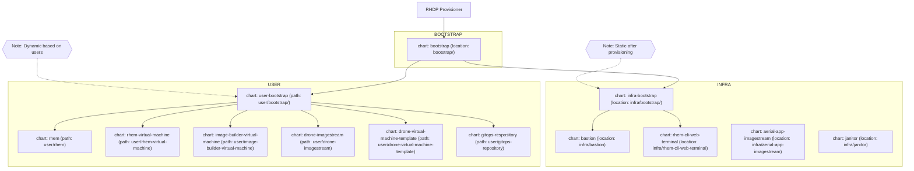

# Red Hat Edge Management Automation for Red Hat Summit 2026

## Deployment


## Charts
The `charts/` directory contains charts that deploy resources for students and shared resources. The following table calls out the charts and their documentation.

| Chart | Description | Path | Example Values |
| --- | --- | --- | --- |
| ACM and RHEM | Installs the ACM operator, and creates an instance of MultiClusterHub with the Edge Manager preview plugin | `charts/acm-rhem/` | [Example Values](./charts/acm-rhem/example-values.yaml) |
| Bootc Image Pipeline | Creates a pipeline that builds bootc images, and imports them for OCP virtualization | `charts/bootc-image-pipeline/` | [Example Values](./charts/bootc-image-pipeline/example-values.yaml) |
| Build Bootc Images | Launches the bootc image pipeline to build the base bootc images for the workshop | `charts/build-bootc-images/` | [Example Values](./charts/build-bootc-images/example-values.yaml) |
| Build Flightctl CLI | Builds an image that has the flightctl CLI baked in, stores it in the internal registry | `charts/build-flightctl-cli/` | [Example Values](./charts/build-flightctl-cli/example-values.yaml) |
| Build Images RBAC | Creates the appropriate rbac for a service account to build images using the build service | `charts/build-images-rbac/` | None required |
| Create Flightctl Agent Config | Creates a configmap with the flightctl agent config used in bootc builds, also create the initial fleet in flightctl | `charts/create-flightctl-agent-confg/` | [Example Values](./charts/create-flightctl-agent-config/example-values.yaml) |
| Example Store Devices | Creates virtual machines and resources as examples for students | `charts/example-store-devices/` | [Example Values](./charts/example-store-devices/values.yaml) |
| Pipelines | Installs the pipelines functionality onto OCP | `charts/pipelines/` | None required |
| Registry Auth | Creates a configmap with a registry auth file, useful for builds later on | `charts/registry-auth/` | None required |
| Student Namespaces | Creates a shared namespace called `student-services`, and optionally creates namespaces for students according to a provided list | `charts/student-namespaces/` | [Example Values](./charts/student-namespaces/example-values.yaml) |
| Student Virtual Machines | Creates virtual machines and supporting resources for students | `charts/student-virtual-machines/` | [Example Values](./charts/student-virtual-machines/example-values.yaml) |
| Enable RHSM in Builds | Copies the RHSM secret from the ocp-managed namespace to other namespaces for running builds with RHSM in them | `charts/enable-rhsm-in-builds/` | None required |
| Populate Pull Secret | Copies the cluster pull secret into a secret in the chart's deployment namespace | `charts/populate-pull-secret/` | None requied |
| Update Web Terminal | Updates the DevWorkspaceTemplate used by the terminal in the web console to use a custom image | `charts/update-web-terminal/` | [Example Values](./charts/update-web-terminal/example-values.yaml) |
| Flightctl RBAC | Creates a rolebinding so students are admins in flightctl | `charts/flightctl-rbac/` | [Example Values](./charts/flightctl-rbac/example-values.yaml) |

## Input Values
The following is an example of all values required by all charts to deploy, as an example:
```yaml
---
gitRepo: https://github.com/rhpds/edge-fleet-gitops.git

gitSource:
  url: https://github.com/rhpds/edge-fleet-gitops.git
  ref: main

advancedClusterManagement:
  storageClassName: your-storage-class-here

openshiftAuth:
  username: your-username-here
  password: your-password-here

bootcImageBuilderConfig:
  username: example-username
  password: example-password

pullSecret: 'your-pull-secret-here'

students:
  - student1
  - student2
  - student3

virtualMachines:
  storageSize: 30Gi
  storageClass: example-storage-class
  sourcePvcName: source-pvc-here
  sourcePvcNamespace: student-services

bootcImages:
  - name: rhel9-bootc-edgemanager-base
    version: 1.0.0
    containerfilesDirectory: builds/rhel9-bootc-edgemanager-base
    gitRepo: https://github.com/rhpds/edge-fleet-gitops.git
    gitRef: main
    containerfilePath: Containerfile
    dataVolumeStorageClass: ocs-external-storagecluster-ceph-rbd-immediate
    dataVolumeSize: 30Gi
    bootcImageBuilderConfigMap: bootc-image-builder-config
  - name: rhel9-bootc-edgemanager-pos-prod
    version: 1.0.0
    containerfilesDirectory: builds/rhel9-bootc-edgemanager-pos-prod
    gitRepo: https://github.com/rhpds/edge-fleet-gitops.git
    gitRef: main
    containerfilePath: Containerfile
    dataVolumeStorageClass: ocs-external-storagecluster-ceph-rbd-immediate
    dataVolumeSize: 30Gi
    bootcImageBuilderConfigMap: bootc-image-builder-config
```
